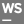
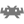
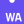

  
  
  

    
  

  
  
  I am a Full Stack Developer from Argentina.

- :telescope: I’m working as a Software Engineer. Building the frontend and backend of web applications at [Egg Cooperation](https://www.eggcooperation.com/es-AR/).

- :zap: In my free time, I ...

- :mailbox: How to reach me: 

---

### :hammer_and_wrench: Languages and Tools :

### Favourite tools

    
    
    
    
    
    
    
    
    
    
    
    
    
    
    
    
    

### Honorable Mention

    
    
    
    
    
    
    
    
    
    
    
    
    
    
    
    
    
    
    
    
    
    
    
    
    
     
    
    

### Spare time:

     
    
    
    
    
    
    
    
    

### Not quite convinced:

    
    
    
    
    

### Want to try

    
    
    
    
    
    
    
    
    
    
    
    
    

<!--
**DBFritz/DBFritz** is a ✨ _special_ ✨ repository because its `README.md` (this file) appears on your GitHub profile.

Here are some ideas to get you started:

- 🔭 I’m currently working on ...
- 🌱 I’m currently learning ...
- 👯 I’m looking to collaborate on ...
- 🤔 I’m looking for help with ...
- 💬 Ask me about ...
- 📫 How to reach me: ...
- 😄 Pronouns: ...
- ⚡ Fun fact: ...
-->
